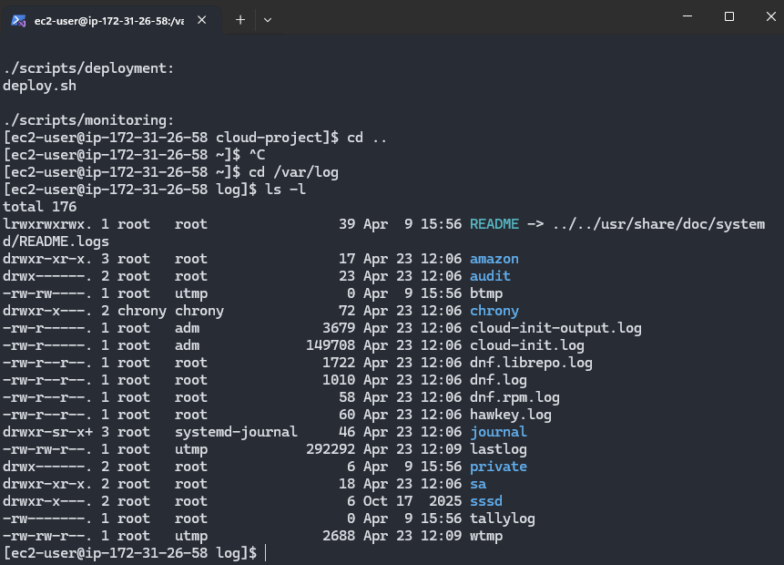
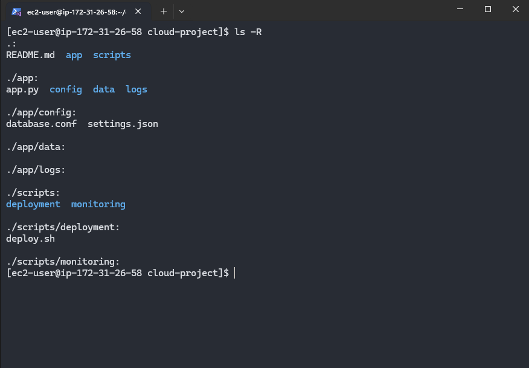
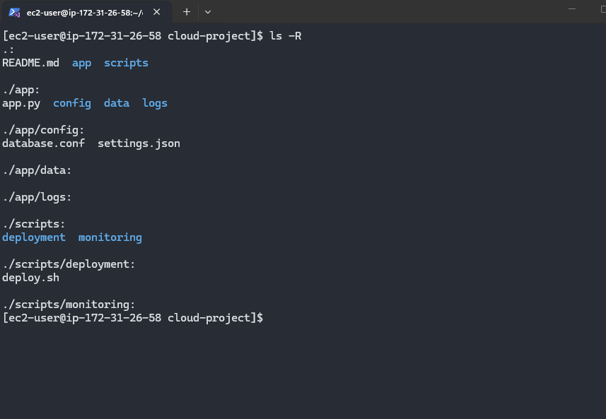
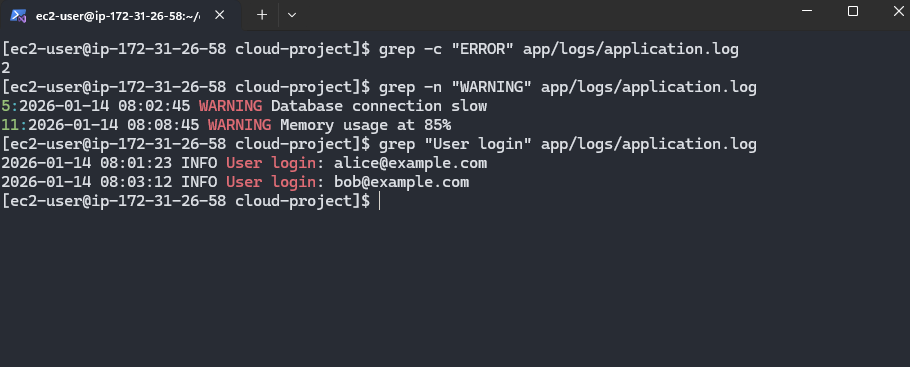
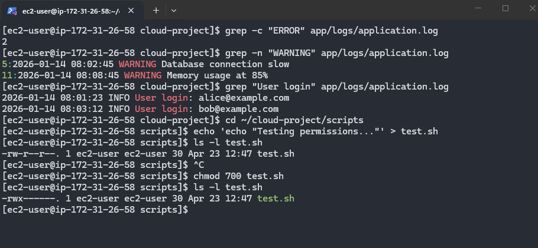
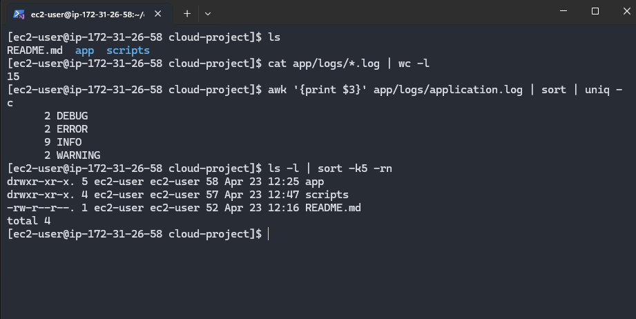
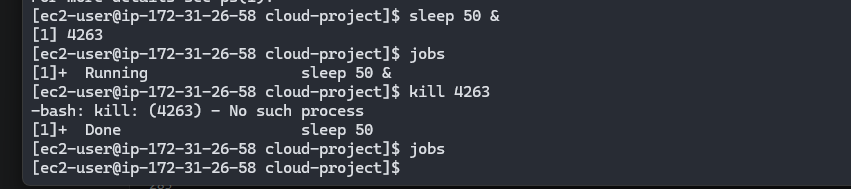
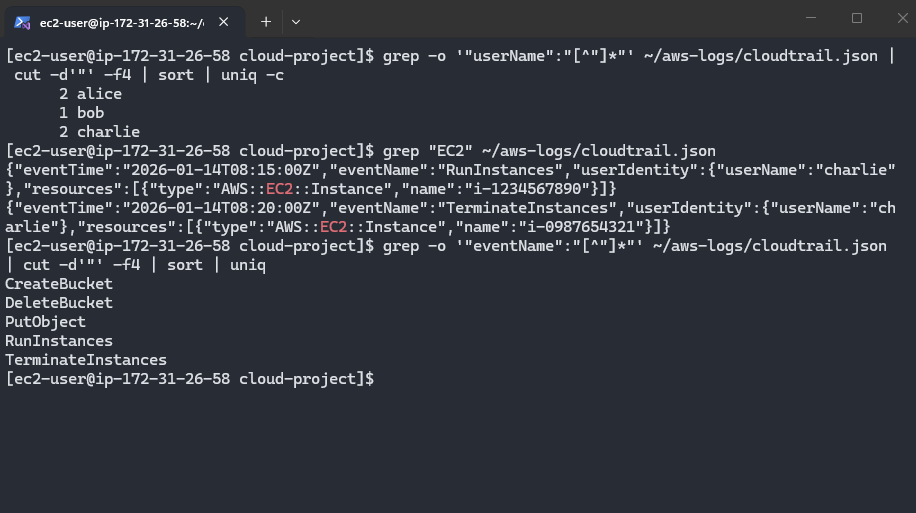
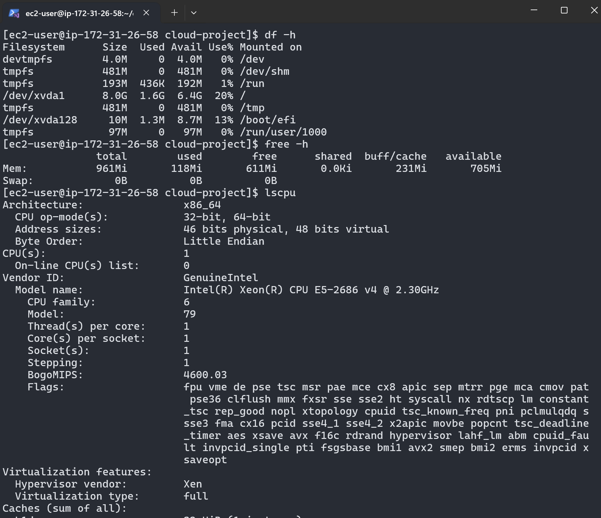

# Lab Solution: Linux Command Line Essentials

**Student Name:** Guangzheng Li  
**Date:** 23/04/2026  
**Environment Used:** Local Linux

---

## Part 1: Environment Setup

### Connection Information

**Command used to connect:**
```bash
 ssh -i my-frankfurt-key.pem ec2-user@18.159.52.43
```

**Output of `whoami`:**
```
ec2-user
```

**Output of `pwd`:**
```
/home/ec2-user
```

**Output of `uname -a`:**
```
Linux ip-172-31-26-58.eu-central-1.compute.internal 6.1.166-197.305.amzn2023.x86_64 #1 SMP PREEMPT_DYNAMIC Mon Mar 23 09:53:26 UTC 2026 x86_64 x86_64 x86_64 GNU/Linux
```

---

## Part 2: Navigation Practice

### Task: Navigate to /var/log and back

**Commands executed:**
```bash
# Navigate to /var/log
cd /var/log

# List contents
ls -l

# Return to home directory
cd ~
```

**Screenshot 1: /var/log directory listing**


---

## Part 3: Directory Structure Creation

### Project Structure

**Commands to create directory structure:**
```bash
# Create cloud-project directory
mkdir cloud-project

# Create nested directories
mkdir -p app/config
mkdir -p app/logs
mkdir -p app/data
mkdir -p scripts/deployment
mkdir -p scripts/monitoring

# Create files
touch app/app.py
touch app/config/settings.json
touch app/config/database.conf
touch scripts/deployment/deploy.sh
touch README.md
```

**Screenshot 2: Project structure (tree or ls -R output)**


---

## Part 4: File Operations

### Copy, Move, Delete Practice

**Commands for test directory task:**
```bash
# Create test directory with files
mkdir test-dir
touch test-dir/file1.txt test-dir/file2.txt test-dir/file3.txt

# Make backup copy
cp -r test-dir test-dir-copy

# Rename backup
mv test-dir-copy test-dir-old

# Delete backup
rm -r test-dir-old

# Verify final state
ls -l
```

**Screenshot 3: File operations results**


---

## Part 5: Viewing File Contents

### Log File Analysis

**Output of last 3 lines:**
```
2026-01-14 08:15:30 INFO Backup completed successfully
2026-01-14 08:20:00 DEBUG Garbage collection triggered
2026-01-14 08:25:15 INFO Health check: OK
```

**Command used:**
```bash
tail -n 3 app/logs/application.log
```

---

## Part 6: Searching with grep

### Task: Search log file

**1. Count ERROR messages:**
```bash
# Command:
grep -c "ERROR" app/logs/application.log
# Output:
2
```

**2. Find WARNING messages with line numbers:**
```bash
# Command:
grep -n "WARNING" app/logs/application.log
# Output:
5:2026-01-14 08:02:45 WARNING Database connection slow
11:2026-01-14 08:08:45 WARNING Memory usage at 85%
```

**3. Extract user login events:**
```bash
# Command:
grep "User login" app/logs/application.log
# Output:
2026-01-14 08:01:23 INFO User login: alice@example.com
2026-01-14 08:03:12 INFO User login: bob@example.com
```

**Screenshot 4: grep search results**


---

## Part 7: File Permissions

### Task: Create and secure script

**Commands executed:**
```bash
# Create test script
cd ~/cloud-project/scripts
echo 'echo "Testing permissions..."' > test.sh

# Check initial permissions
ls -l test.sh

# Make executable for owner only
chmod 700 test.sh

# Verify permissions

```

**Initial permissions:** -rw-r--r--

**Final permissions:** -rwx------

**Screenshot 5: Permission changes**


### Secure Backup Script

**Script content:**
```bash
echo "DB_PASSWORD=secret123" > app/config/database.conf

```

**Permissions set:**
```bash
# Command:
chmod 600 app/config/database.conf

# Result (ls -l):
-rw-------. 1 ec2-user ec2-user 22 Apr 23 12:58 app/config/database.conf
```

---

## Part 8: Pipes and Redirects

### Task: Command chaining

**1. Count total lines in all .log files:**
```bash
# Command:
cat app/logs/*.log | wc -l
# Result:
15
```

**2. Find unique log levels and count:**
```bash
# Command:
awk '{print $3}' app/logs/application.log | sort | uniq -c
# Result:
      2 DEBUG
      2 ERROR
      9 INFO
      2 WARNING
```

**3. List files sorted by size:**
```bash
# Command:
ls -l | sort -k5 -rn
# Result:
drwxr-xr-x. 5 ec2-user ec2-user 58 Apr 23 12:25 app
drwxr-xr-x. 4 ec2-user ec2-user 57 Apr 23 12:47 scripts
-rw-r--r--. 1 ec2-user ec2-user 52 Apr 23 12:16 README.md
total 4
```

**Screenshot 6: Pipes and redirects output**


---

## Part 9: Process Management

### Task: Background process

**1. Start long-running command in background:**
```bash
# Command:
sleep 50 &
# Output (job number):
[1] 4263
```

**2. List all jobs:**
```bash
# Command:
jobs
# Output:
[1]+  Running                 sleep 50 &
```

**3. Kill the process:**
```bash
# Command:
kill 4263
# Verification:
[1]+  Done                    sleep 50
```

**Screenshot 7: Process management**


---

## Part 10: Cloud Engineering Scenarios

### CloudTrail Log Analysis

**1. Events per user:**
```bash
# Command:
grep -o '"userName":"[^"]*"' ~/aws-logs/cloudtrail.json | cut -d'"' -f4 | sort | uniq -c
# Result:
      2 alice
      1 bob
      2 charlie
```

**2. EC2 operations:**
```bash
# Command:
grep "EC2" ~/aws-logs/cloudtrail.json
# Result:
{"eventTime":"2026-01-14T08:15:00Z","eventName":"RunInstances","userIdentity":{"userName":"charlie"},"resources":[{"type":"AWS::EC2::Instance","name":"i-1234567890"}]}
{"eventTime":"2026-01-14T08:20:00Z","eventName":"TerminateInstances","userIdentity":{"userName":"charlie"},"resources":[{"type":"AWS::EC2::Instance","name":"i-0987654321"}]}
```

**3. Unique event types:**
```bash
# Command:
grep -o '"eventName":"[^"]*"' ~/aws-logs/cloudtrail.json | cut -d'"' -f4 | sort | uniq
# Result:
CreateBucket
DeleteBucket
PutObject
RunInstances
TerminateInstances
```

**Screenshot 8: CloudTrail analysis**


### System Monitoring

**1. Disk space:**
```bash
# Command: df -h

# Total space: 8.0G  
# Used: 1.6G
# Available: 6.4G
# Usage %: 20%
```

**2. Available memory:**
```bash
# Command: free -h

# Total: 961Mi
# Used: 118Mi
# Free: 611Mi
```

**3. CPU cores:**
```bash
# Command: lscpu

# CPU(s): 1
# Model: Intel(R) Xeon(R) CPU E5-2686 v4 @ 2.30GHz
```

**Screenshot 9: System resources**


---

## Command Cheat Sheet (Your Most Used)

**List your 10 most-used commands from this lab:**

1. pwd
2. ls
3. mkdir
4. cp
5. touch
6. cat
7. mv
8. rm
9. cd
10. grep

---

## Reflection Questions

### 1. How do file permissions enhance security in cloud environments?

**Your answer:**
```
Permissions enforce the Principle of Least Privilege by restricting access to sensitive files like SSH keys. Even if a user account is compromised, proper permissions prevent attackers from modifying or executing critical system files.
```

### 2. Why is piping commands together more efficient than intermediate files?

**Your answer:**
```
Piping processes data directly in memory between commands without the need to write to disk. This saves time, reduces I/O overhead, and keeps your workspace clean from temporary files.
```

### 3. Describe a real-world scenario where you'd use `tail -f`.

**Your answer:**
```
I would use tail -f to monitor an application log in real-time during a deployment. It allows me to immediately see errors or stack traces as they happen, helping me decide if I need to roll back the update.
```

### 4. What's the difference between killing with `kill` vs `kill -9`?

**Your answer:**
```
kill sends a 'graceful' signal (SIGTERM), giving the process a chance to save data and clean up. kill -9 (SIGKILL) is an immediate forced termination that doesn't allow the process to finish its current task, which might lead to data corruption.
```

### 5. How does Linux CLI proficiency help with AWS CLI usage?

**Your answer:**
```
AWS CLI output (like JSON) is often processed using standard Linux tools like grep, cut, and awk. Mastering the Linux terminal makes it much easier to automate cloud tasks and script complex AWS workflows.
```

---

## Troubleshooting Log

**Did you encounter any issues?** (Yes/No): yes

**If yes, document:**

| Issue | Commands Tried | Solution | Time Spent |
|-------|---------------|----------|------------|
|       |               |          |            |
|       |               |          |            |
|       |               |          |            |

---

## Cleanup Confirmation

- [ ] Removed ~/cloud-project directory
- [ ] Removed ~/aws-logs directory
- [ ] Verified no leftover files

**Cleanup commands:**
```bash
cd ~
rm -rf cloud-project
rm -rf aws-logs
```

---

## Self-Assessment

**Rate your confidence (1-5, where 5 is expert):**

| Skill | Before Lab | After Lab | Notes |
|-------|-----------|-----------|-------|
| Filesystem navigation | 3/5 | 4/5 | |
| File manipulation | 3/5 | 4/5 | |
| Viewing/searching files | 2/5 | 4/5 | |
| File permissions | 1/5 | 4/5 | |
| Pipes and redirects | 0/5 | 3/5 | |
| Process management | 2/5 | 4/5 | |
| Log analysis | 1/5 | 4/5 | |

---

## Bonus Challenges Completed

- [ ] Explored `awk` for text processing
- [ ] Created a shell script with multiple commands
- [ ] Used `find` with complex criteria
- [ ] Practiced `sed` for text replacement
- [ ] Set up custom bash aliases

**Bonus notes:**
```
_____________________________________________________________
_____________________________________________________________
_____________________________________________________________
```

---

## Instructor Verification

**Instructor Name:** ___________________________

**Date Reviewed:** ___________________________

**All tasks completed:** ☐ Yes ☐ No

**Comments:**
```
_____________________________________________________________
_____________________________________________________________
_____________________________________________________________
```

**Grade/Status:** ___________________________

---

**Lab Status:** ☐ Complete ☐ Needs Revision

**Total Time Spent:** ________ minutes

**Submission Date:** ___________________________
